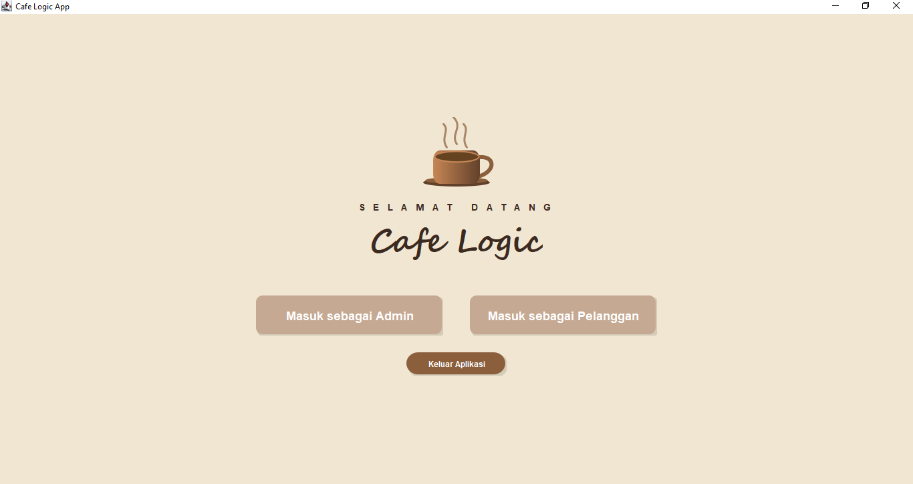
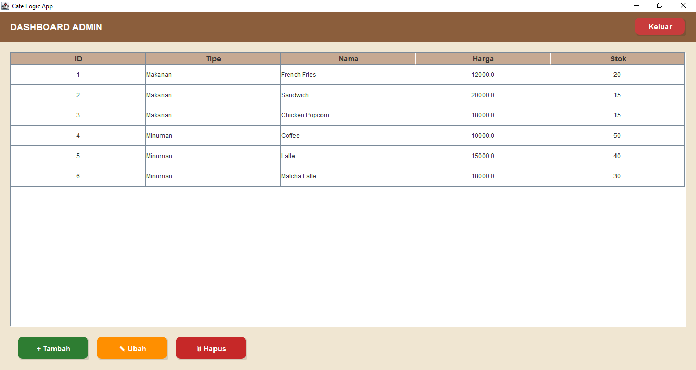
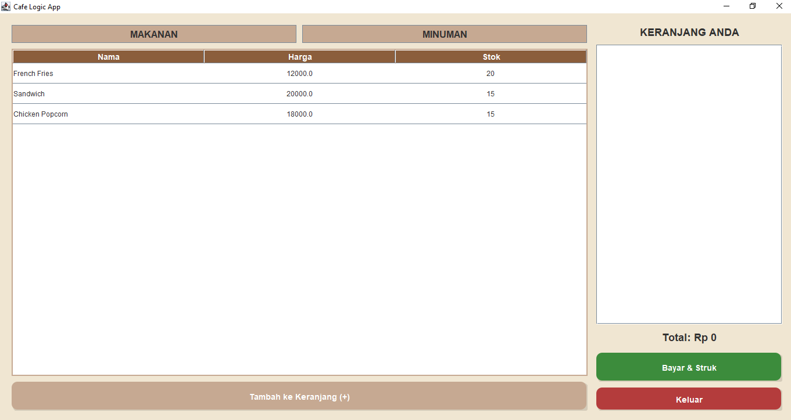
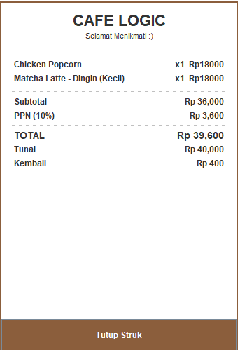

# CafeLogic Mini Cafe System

Simulasi sistem pemesanan kafe modern berbasis **Java Swing**, menerapkan berbagai **Design Pattern** seperti **Singleton**, **Factory**, dan terutama **Decorator Pattern** untuk kustomisasi minuman.

---

## 👥 Informasi Kelompok

| Anggota              | NIM       |
| -------------------- | --------- |
| Helga Athifa Hidayat | 241511087 |
| Nike Kustiane        | 241511086 |
| Qlio Amanda Febriany | 241511087 |

---

## ✨ Fitur Utama

### ☕ Custom Minuman dengan Decorator Pattern

* Kustomisasi ukuran gelas, suhu, dan topping.
* Penambahan biaya serta modifikasi nama menu dilakukan secara dinamis.

### 🛠 Dashboard Admin

* Fitur CRUD menu makanan & minuman.
* Monitoring stok menu.
* **Login:** `admin` / `123`

### 🛒 Sistem Pemesanan Pelanggan

* Pilih menu, tambah ke keranjang, dan lakukan checkout.

### 📦 Manajemen Stok

* Stok otomatis berkurang setelah transaksi selesai.

### 🧾 Pencatatan Transaksi

* Semua transaksi disimpan ke `database_transaksi.jsonl`.

### 🖨 Cetak Struk

* Struk tampil di layar & dicetak ke `struk.txt`.

---

## 🖼️ Screenshot Aplikasi

Berikut adalah urutan tampilan aplikasi yang dapat Anda tambahkan sebagai screenshot:

### 🔐 Halaman Login



### 🛠 Dashboard Admin



### 🧍‍♀️ Halaman Pelanggan



### 🧾 Struk Pembayaran



````

---

## 🚀 Cara Menjalankan Program
Pastikan berada di direktori utama proyek `CafeLogic_MiniCafeSystem` dan telah menginstal **JDK**.

### 1️⃣ Kompilasi Program
javac -d bin -sourcepath src src/cafe/app/MainApp.java

### 2️⃣ Jalankan Aplikasi
java -cp bin cafe.app.MainApp
---

